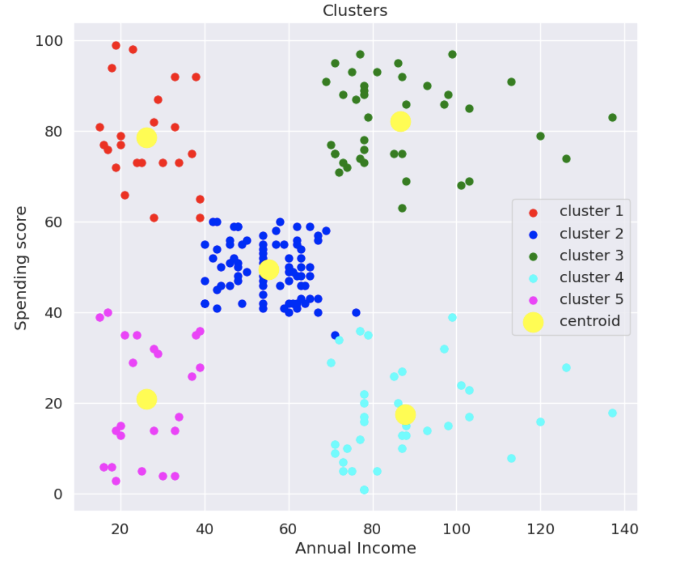

# Customer Segmentation using K-Means Clustering

### Customer Data is taken from a Shopping Mall. which contains :     

> 1.   Customer Age
> 2.   Customer Annual Salary
> 3.   Spending score (1-100, 100 meaning the person is an avid shopper)

### A K-Means Clustering algorithm is built around the dataset such that the customers are Seperated/Clustered into different catagories.

[ This dataset was used as it is simple & easy to understand for the viewers, please feel free to use datasets with more number of features ]

---

## Analysis of the above graph :

### Clusters in order :
1.   *Red* - These are people with **low income** but yet **high spends** in shopping. - Should be presented with more discounted products.
2.   *Blue* - Customers with **average income** and **average spends** - Its volatile and much cant be done to this segment.
3.   *Green* - Customers with **high income**, **high spends** - Must be presented with premium products.
4.   *Cyan* - **High income, low spends** - Make them understand the brand/s more and push in offers accordingly.
5.   *pink* - **Low income, low spends** - Should be presented with discounted products.

This way Clustering can be utilized inorder to do ***Targeted Marketing*** efficiently .
